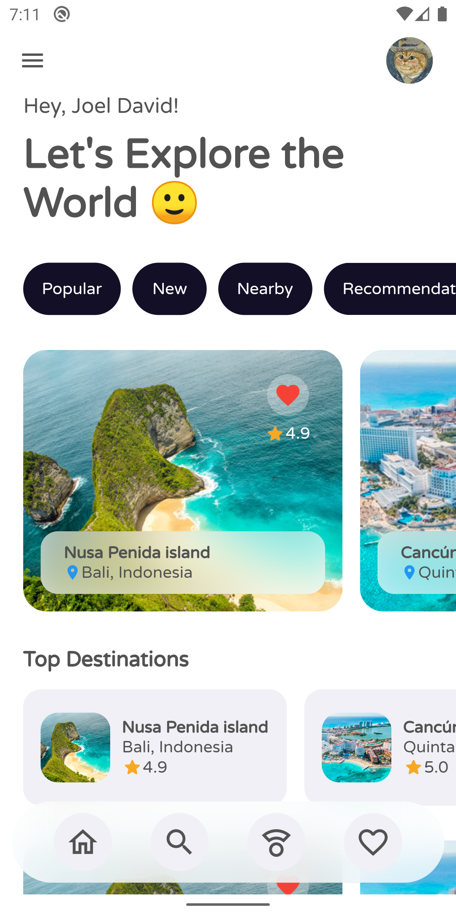
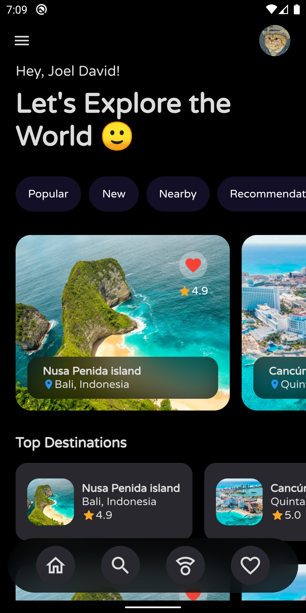

# Travel app - Flutter

ENG: In our travel application, the user interface has two pages, one is the home page where we can find suggestions for places with location and ratings. On the details page, show the price of the trip and more information about the place.

ESP: En nuestra aplicacion de viajes, la interfaz de usuario tiene dos páginas, una es el home donde podemos encontrar sugerencias de lugares con ubicación y valoración. En la pagina de detalles, muestra el precio del viaje y mas información del lugar.

### Travel App Final UI

